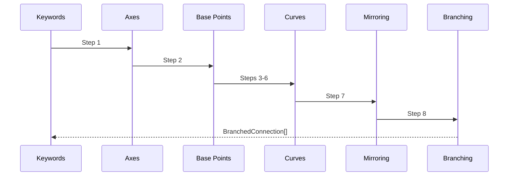
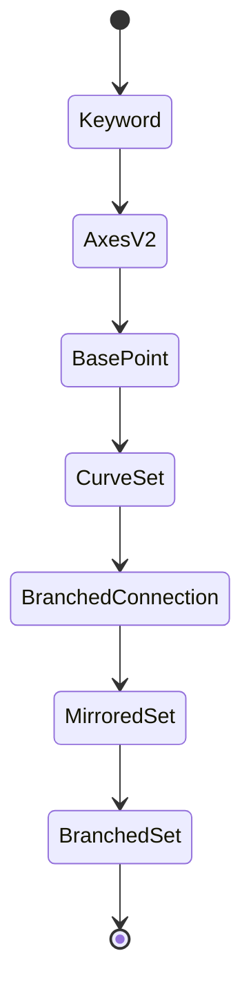

# SPEC_04 — COSMOGRAPH ENGINE
## Sistema di Generazione Simboli Cosmopolitici

**Versione**: 4.0  
**Data**: 2025-01-19  
**Status**: Living Document  
**Sostituisce**: SPEC_03 + Patch01-04 + Branching_beta01

---

## 1. EXECUTIVE SUMMARY

### 1.1 Scopo del documento
SPEC_04 consolida in un'unica fonte tecnica lo stato attuale del motore ENGINE_V2 dopo SPEC_03, patch01-04 e Branching_beta01. Descrive mappature semantiche, pipeline geometrica a otto step, interfaccia di controllo, garanzie di determinismo e modalità di estensione usando esclusivamente il comportamento verificabile nel codice sorgente.

### 1.2 Architettura ad alto livello
```mermaid
flowchart LR
  A[Keyword list] --> B[Step 1<br/>Semantic axes]
  B --> C[Step 2<br/>Base position]
  C --> D[Step 3<br/>Point dispersion]
  D --> E[Step 4<br/>Direction clustering]
  E --> F[Step 5<br/>Length profiles]
  F --> G[Step 6<br/>Curvature profiles]
  G --> H[Step 7<br/>Final mirroring]
  H --> I[Step 8<br/>Branching]
  I --> J[BranchedConnection[]]
```
La sequenza deriva dall'orchestrazione in `generateEngineV2` e integra mirroring finale e branching post-mirroring come fasi distinte (da `lib/engine_v2/engine.ts:9-279`).

### 1.3 Differenze da SPEC_03
| Feature | SPEC_03 | SPEC_04 |
| --- | --- | --- |
| Mirroring | Antecedente alla generazione lineare | Applicato come trasformazione finale deterministica sull'intera geometria, con asse scelto da bounding box e centrato sul canvas (`lib/engine_v2/finalMirroring.ts:12-365`). |
| Origine linee | Tutte le linee partivano dall'ancora Alfa/Beta | Solo la prima linea resta sull'ancora, le successive usano dispersione circolare deterministica 2% diagonale (`lib/engine_v2/curves.ts:445-460`). |
| Direzioni | Gamma → angolo continuo ±45° | Gamma ruota cluster discreti 0°-180° con jitter configurabile, pilotati da slider `clusterCount`/`clusterSpread` (`lib/engine_v2/curves.ts:80-127` e `app/page.tsx:194-221`). |
| Lunghezze/curvature | Uniformi salvo jitter globale | Profili discreti per linea con correlazione inversa e slider globali `lengthScale`/`curvatureScale` (`lib/engine_v2/curves.ts:473-536` e `app/page.tsx:194-208`). |
| Branching | Non presente | Nuovi rami da intersezioni post-mirroring con hard cap 30 intersezioni e 1–2 rami deterministici ciascuna (`lib/engine_v2/branching.ts:127-197`). |

### 1.4 Garanzie del sistema
- Determinismo end-to-end: seed basato su keywords + dimensioni canvas via `cyrb53`, nessun slider influisce sul seed (`app/page.tsx:150-207`).
- Tutti i PRNG usano prefissi espliciti e ripetibili implementati da `prng`/`seededRandom` (`lib/seed.ts:1-40`).
- Canvas bounds sono sempre rispettati da `clampToCanvas` per punti dispersi, estremi e rami (`lib/engine_v2/curves.ts:311-321`, `lib/engine_v2/branching.ts:154-193`).
- Mirroring e branching operano su `BranchedConnection` standard preservando compatibilità con pipeline di rendering (`lib/engine_v2/engine.ts:227-279`).

---

## 2. SEMANTIC AXES

### 2.1 Alfa — Azione ↔ Osservazione
Alfa controlla la posizione X normalizzata tramite `xNorm = 0.5 + (Alfa / 200)` clamped in [0,1], quindi determina la colonna di partenza delle linee (`lib/engine_v2/position.ts:32-41`).

### 2.2 Beta — Specifico ↔ Ampio
Beta controlla `yNorm = 0.5 - (Beta / 200)` clamped in [0,1], fissando la riga di partenza delle linee e contribuendo alla scelta del quadrante (`lib/engine_v2/position.ts:32-75`).

### 2.3 Gamma — Unico ↔ Composto
Gamma definisce numero linee, direzioni e lunghezze con intervalli: 1–7 linee via `lineCount = 1 + round(|gamma|/100 * 6)` (`lib/engine_v2/curves.ts:36-52`), angoli 0°–180° per cluster (`lib/engine_v2/curves.ts:80-127`), e lunghezza base 15%–50% della diagonale (`lib/engine_v2/curves.ts:203-225`).

### 2.4 Delta — Regolare ↔ Irregolare
Delta regola la curvatura: offset perpendicolare compreso tra 5% e 30% della lunghezza con jitter ±20%, oltre alla direzione del piegamento (`lib/engine_v2/curves.ts:340-395`).

### 2.5 Keyword → Axes Mapping System
- Normalizzazione: trim + lowercase (`lib/engine_v2/axes.ts:29-31`).
- Sanitizzazione: verifica numerica e clamp [-100,+100] (`lib/engine_v2/axes.ts:45-85`).
- Dizionario: `semantic-map-v2.json` caricato una volta con chiavi normalizzate (`lib/engine_v2/axes.ts:129-160`).
- Fallback deterministico: `seedrandom("axes_v2:" + keyword)` produce quattro assi stabili (`lib/engine_v2/axes.ts:99-113`).
- API pubblica: `getAxesForKeywordV2` restituisce sempre un `AxesV2` valido (`lib/engine_v2/axes.ts:180-194`).

---

## 3. GEOMETRY PIPELINE

### Overview


### 3.1 Step 1: Keyword → Semantic Axes
**Input**: array di keywords (max 10) (`lib/engine_v2/engine.ts:138-156`).  
**Output**: lista `{keyword, axes}` con valori [-100,+100].  
**Algoritmo**: normalizza, cerca nel dizionario e applica fallback se mancante (`lib/engine_v2/axes.ts:29-194`).  
**Implementazione**: `getSemanticMapV2` + `getAxesForKeywordV2` in `engine.ts`. 

### 3.2 Step 2: Alfa/Beta → Base Position
**Input**: `AxesV2`.  
**Output**: coordinate normalizzate/pixel e quadrante (`lib/engine_v2/engine.ts:158-172`).  
**Formule**: `xNorm = 0.5 + (Alfa / 200)`, `yNorm = 0.5 - (Beta / 200)`, `x = xNorm * width`, `y = yNorm * height` (`lib/engine_v2/position.ts:32-55`).  
**Implementazione**: `axesToNormalizedPosition`, `normalizedToPixel`, `getQuadrant`. 

### 3.3 Step 3: Point Dispersion
**Scopo**: evitare raggi stellari sovrapposti.  
**Algoritmo**: prima linea usa l'ancora, le successive estraggono un punto in un cerchio di raggio `0.02 * diagonale` con distribuzione uniforme sull'area (`lib/engine_v2/curves.ts:445-460`).
**Parametri**: `dispersionRadius = 0.02` (2% diagonale) (`lib/engine_v2/curves.ts:245-325`).  
**Seed prefixes**: `'${seed}:disperse:${pointIndex}:${lineIndex}'` per angolo e distanza (`lib/engine_v2/curves.ts:291-309`).  
**Implementazione**: `generateDispersedStartPoint` clampato al canvas.  
**Introdotta in**: patch02, come documentato nel changelog (`docs/changes/CHANGELOG_SFCM_SYMBOLS.md:155-189`).

### 3.4 Step 4: Line Generation with Direction Clustering
**Scopo**: distribuire direzioni in cluster equidistanti e ruotati da Gamma.  
**Algoritmo**: assegna ogni linea a `clusterCount` cluster su 0°-180°, ruota di `(gamma/100)*180°`, applica jitter `±clusterSpread/2` e clampa (`lib/engine_v2/curves.ts:80-127`).  
**Parametri configurabili**: `clusterCount` default 3, `clusterSpread` default 30° (`lib/engine_v2/engine.ts:130-134`).  
**Seed prefixes**: `'${seed}:cluster:${lineIndex}'` per cluster, `'${seed}:jitter:${lineIndex}'` per jitter.  
**Implementazione**: `getLineDirectionWithDebug` + `generateCurveFromPoint`.  
**Introdotta in**: patch03 (`docs/changes/CHANGELOG_SFCM_SYMBOLS.md:92-140`).

### 3.5 Step 5: Length with Discrete Profiles
**Scopo**: diversificare le lunghezze intra-cluster mantenendo slider globale.  
**Algoritmo**: calcola lunghezza base = `diag * (0.15 + t*(0.50-0.15))` con jitter ±5% e moltiplica per profilo discreto (`lib/engine_v2/curves.ts:203-225` e `lib/engine_v2/curves.ts:473-492`).  
**Parametri**: profili `[0.5, 0.8, 1.0, 1.3, 1.8]`, slider `lengthScale = 0.7 + (slider/100)*(1.3-0.7)` (`lib/engine_v2/curves.ts:149-155`, `app/page.tsx:194-200`).  
**Seed prefixes**: `'${seed}:length:${pointIndex}'` (jitter base) e `'${seed}:lenProfile:${pointIndex}:${lineIndex}:${clusterIndex}:${clusterCount}'`.  
**Implementazione**: `getLineLength` + `computeLengthProfileMultiplier`.  
**Introdotta in**: patch04 (`docs/changes/CHANGELOG_SFCM_SYMBOLS.md:34-88`).

### 3.6 Step 6: Curvature with Profiles + Inverse Correlation
**Scopo**: modulare la curvatura di ogni linea mantenendo il contributo Delta.  
**Algoritmo**: `curvFrac = 0.05 + (0.30-0.05)*|delta|/100` con jitter ±20% e direzione basata sul segno, poi scala tramite profili `[0.4, 0.75, 1.0, 1.5, 2.0]` correlati inversamente alla lunghezza (`lib/engine_v2/curves.ts:340-395` e `lib/engine_v2/curves.ts:493-536`).  
**Parametri**: slider `curvatureScale = 0.3 + (slider/100)*(1.7-0.3)` (`app/page.tsx:202-208`).  
**Seed prefixes**: `'${seed}:delta:curv:${pointIndex}:${start.x}:${start.y}'`, `'${seed}:delta:dir:${pointIndex}:${start.x}:${start.y}'`, `'${seed}:curvProfile:${pointIndex}:${lineIndex}:${clusterIndex}:${clusterCount}'`.  
**Implementazione**: `applyDeltaIrregularity` + `computeCurvatureProfileMultiplier`.  
**Introdotta in**: patch04 (`docs/changes/CHANGELOG_SFCM_SYMBOLS.md:34-88`).

### 3.7 Step 7: Final Mirroring
**Scopo**: ottenere simmetria reale sull'output finale.  
**Algoritmo**: calcola bounding box, sceglie l'asse (verticale, orizzontale o diagonale) con tolleranza 1% e riflette punti e controlli attorno al centro canvas (`lib/engine_v2/finalMirroring.ts:12-190`).  
**Implementazione**: `applyFinalMirroring` restituisce l'array originale + riflesso (`lib/engine_v2/finalMirroring.ts:281-365`).  
**Introdotta in**: patch01 (`docs/changes/CHANGELOG_SFCM_SYMBOLS.md:363-405`).

### 3.8 Step 8: Intersection-Based Branching
**Scopo**: arricchire il simbolo con ramificazioni derivate dalle intersezioni.  
**Algoritmo rilevamento**: campiona 12 punti per curva, trova intersezioni segmento-segmento e unisce coordinate arrotondate al pixel (`lib/engine_v2/branching.ts:12-125`).  
**Algoritmo generazione rami**: seleziona massimo 30 intersezioni, rimescola deterministicamente, genera 1–2 rami ciascuna usando direzione media e jitter ±60° (`lib/engine_v2/branching.ts:138-193`).  
**Parametri**: lunghezze `diag * (0.06 + rnd*0.06)` (6–12% diagonale), curvatura random `[-0.35, 0.35]` con soglia 0.08 e dashed probability 35% (`lib/engine_v2/branching.ts:166-182`).  
**Seed prefixes**: `'${seed}:branching:intersection:shuffle:${i}'`, `'${seed}:branching:count:${i}'`, `'${seed}:branching:length:${i}:${branchIndex}'`, `'${seed}:branching:angle:${i}:${branchIndex}'`, `'${seed}:branching:curvature:${i}:${branchIndex}'`, `'${seed}:branching:dashed:${i}:${branchIndex}'`.  
**Implementazione**: `applyBranching` ritorna `generationDepth = 1` per i rami (`lib/engine_v2/branching.ts:184-191`).  
**Introdotta in**: Branching_beta01 (`docs/changes/CHANGELOG_SFCM_SYMBOLS.md:9-27`).

---

## 4. CONTROL INTERFACE

### 4.1 Active Sliders
| Slider | Label UI | Range UI | Parametro Engine | Formula Mapping | Default |
| --- | --- | --- | --- | --- | --- |
| Slider1 | "Lunghezza linee" | 0–100 | `lengthScale` | `0.7 + (s/100) * 0.6` (`app/page.tsx:194-200`) | 50 → 1.0 |
| Slider2 | "Curvatura linee" | 0–100 | `curvatureScale` | `0.3 + (s/100) * 1.4` (`app/page.tsx:202-208`) | 50 → 1.0 |
| Slider3 | "Numero Cluster" | 0–100 | `clusterCount` | `round(2 + (s/100)*3)` (`app/page.tsx:209-215`) | 33 → 3 |
| Slider4 | "Ampiezza Cluster" | 0–100 | `clusterSpread` | `10 + (s/100)*50` (`app/page.tsx:216-221`) | 40 → 30° |

### 4.2 Slider Interaction Matrix
| Slider | Step impattato | Effetto |
| --- | --- | --- |
| Slider1 | Step 5 | Scala tutte le lunghezze dopo il profilo discreto ma prima di clamp (`lib/engine_v2/curves.ts:473-518`). |
| Slider2 | Step 6 | Moltiplica l'offset di curvatura dopo i profili e prima del clamp (`lib/engine_v2/curves.ts:493-536`). |
| Slider3 | Step 4/5/6 | Determina quanti cluster di direzione e influenza i seed dei profili (`lib/engine_v2/curves.ts:80-155`). |
| Slider4 | Step 4 | Stabilisce l'ampiezza del jitter intra-cluster (`lib/engine_v2/curves.ts:80-127`). |

### 4.3 Parameter Ranges & Defaults
- `lengthScale` ∈ [0.7, 1.3], default 1.0 (`app/page.tsx:194-200`).
- `curvatureScale` ∈ [0.3, 1.7], default 1.0 (`app/page.tsx:202-208`).
- `clusterCount` ∈ [2, 5], default 3 (`app/page.tsx:209-215`).
- `clusterSpread` ∈ [10°, 60°], default 30° (`app/page.tsx:216-221`).

---

## 5. DETERMINISM GUARANTEES

### 5.1 Randomness Sources Registry
| Feature | Seed Prefix | Parametri | File:Funzione |
| --- | --- | --- | --- |
| Semantic fallback | `'axes_v2:'` + keyword | keyword normalizzato | `lib/engine_v2/axes.ts:fallbackAxesV2` |
| Cluster assignment | `'${seed}:cluster:${lineIndex}'` | seed globale, indice linea | `lib/engine_v2/curves.ts:getLineDirectionWithDebug` |
| Cluster jitter | `'${seed}:jitter:${lineIndex}'` | seed globale, indice linea | `lib/engine_v2/curves.ts:getLineDirectionWithDebug` |
| Length jitter | `'${seed}:length:${pointIndex}'` | seed globale, indice punto | `lib/engine_v2/curves.ts:getLineLength` |
| Length profile | `'${seed}:lenProfile:${pointIndex}:${lineIndex}:${clusterIndex}:${clusterCount}'` | seed, indici | `lib/engine_v2/curves.ts:computeLengthProfileMultiplier` |
| Curvature profile | `'${seed}:curvProfile:${pointIndex}:${lineIndex}:${clusterIndex}:${clusterCount}'` | seed, indici | `lib/engine_v2/curves.ts:computeCurvatureProfileMultiplier` |
| Point dispersion | `'${seed}:disperse:${pointIndex}:${lineIndex}'` | seed, indici | `lib/engine_v2/curves.ts:generateDispersedStartPoint` |
| Delta jitter | `'${seed}:delta:curv:${pointIndex}:${start.x}:${start.y}'` | seed, coordinate start | `lib/engine_v2/curves.ts:applyDeltaIrregularity` |
| Delta flip | `'${seed}:delta:dir:${pointIndex}:${start.x}:${start.y}'` | seed, coordinate start | `lib/engine_v2/curves.ts:applyDeltaIrregularity` |
| Branch shuffle | `'${seed}:branching:intersection:shuffle:${i}'` | seed, indice shuffle | `lib/engine_v2/branching.ts:138-150` |
| Branch count | `'${seed}:branching:count:${i}'` | seed, indice intersezione | `lib/engine_v2/branching.ts:161-165` |
| Branch length | `'${seed}:branching:length:${i}:${branchIndex}'` | seed, indici | `lib/engine_v2/branching.ts:166-168` |
| Branch angle | `'${seed}:branching:angle:${i}:${branchIndex}'` | seed, indici | `lib/engine_v2/branching.ts:169-170` |
| Branch curvature | `'${seed}:branching:curvature:${i}:${branchIndex}'` | seed, indici | `lib/engine_v2/branching.ts:179-180` |
| Branch dashed | `'${seed}:branching:dashed:${i}:${branchIndex}'` | seed, indici | `lib/engine_v2/branching.ts:181-182` |

### 5.2 Determinism Contract
- Seed globale = `cyrb53(keywords.join(",") + "-" + width + "-" + height)` (`app/page.tsx:154-201`).
- Nessun parametro UI altera il seed; gli slider agiscono come moltiplicatori nel pipeline (`app/page.tsx:194-221`).
- Tutti gli effetti random sono clamped e riproducibili grazie a `seedrandom` (`lib/seed.ts:1-40`).

### 5.3 Testing Determinism
- Verificare che la stessa combinazione input → stesso `EngineV2Result`, confrontando `connections` e `debug` dopo due esecuzioni consecutive.
- Validare i prefissi di seed confrontando l'output di `seededRandom` con snapshot attesi per linee selezionate.

### 5.4 Breaking Changes Policy
Qualsiasi modifica a un prefisso di seed, agli intervalli numerici documentati o all'ordine della pipeline richiede una nuova major version del documento e aggiornamenti alla tabella della sezione 5.1.

---

## 6. CANVAS SIZE SYSTEM

### 6.1 Supported Formats
Preset disponibili: `square 1080×1080`, `4_5 1080×1350`, `9_16 1080×1920`, `16_9 1920×1080`, `fit` (viewport o 1080×1080 fallback) e `custom` (`lib/canvasSizeConfig.ts:10-83`).

### 6.2 Resolution Logic
`resolveCanvasSize` restituisce sempre dimensioni positive; per `custom` valida e arrotonda, per `fit` usa viewport >0 altrimenti 1080 (`lib/canvasSizeConfig.ts:46-83`).

### 6.3 Geometry Scaling
Tutti i calcoli di lunghezza e dispersione usano la diagonale `sqrt(width^2 + height^2)` così la pipeline resta proporzionale ai preset (`lib/engine_v2/curves.ts:203-225` e `lib/engine_v2/curves.ts:245-325`).

---

## 7. EXTENSION POINTS

### 7.1 Patch Implementation Workflow
Consulta `docs/development/guides/PATCH_IMPLEMENTATION_GUIDE.md` per uno schema operativo in quattro fasi:
- **Analisi**: identifica esattamente dove inserire il nuovo step leggendo l'ordine della pipeline e il contratto dei tipi (`docs/development/guides/PATCH_IMPLEMENTATION_GUIDE.md:4-12`).
- **Progettazione**: definisci seed prefixes e clamp riutilizzando `prng` e gli helper canvas (`docs/development/guides/PATCH_IMPLEMENTATION_GUIDE.md:14-20`).
- **Integrazione**: collega il modulo al motore rispettando `EngineV2Options` e testando `generateEngineV2` con seed ripetibili (`docs/development/guides/PATCH_IMPLEMENTATION_GUIDE.md:22-28`).
- **Documentazione**: aggiorna changelog, SPEC e indice docs per mantenere l'allineamento di tutto l'ecosistema (`docs/development/guides/PATCH_IMPLEMENTATION_GUIDE.md:30-34`).

### 7.2 Feature Implementation Workflow
Per nuove feature UI/engine usa la guida `docs/guides/feature-implementation-workflow.md`:
- **Allineamento** con SPEC_04 e `EngineV2Options` per evitare duplicazioni (`docs/guides/feature-implementation-workflow.md:4-10`).
- **Aggiornamento UI** con mapping 0–100 → parametro e rispetto della seed neutrality (`docs/guides/feature-implementation-workflow.md:12-20`).
- **Estensione motore** propagando il parametro nell'oggetto `options` e gestendo nuovi seed (`docs/guides/feature-implementation-workflow.md:22-30`).
- **Tipi, debug e QA**: sincronizza `lib/types.ts`, DebugOverlay e documentazione (`docs/guides/feature-implementation-workflow.md:32-40`).

### 7.3 Pipeline Modification Playbook
Le modifiche strutturali alla pipeline devono seguire il playbook dedicato `docs/development/guides/PIPELINE_MODIFICATION_PLAYBOOK.md`:
- **Compatibilità**: preserva il formato `BranchedConnection` e la posizione fissa di mirroring/branching (`docs/development/guides/PIPELINE_MODIFICATION_PLAYBOOK.md:4-8`).
- **Determinismo**: mantieni invariato il seed globale e registra ogni nuova randomizzazione (`docs/development/guides/PIPELINE_MODIFICATION_PLAYBOOK.md:10-14`).
- **Integrità geometrica**: usa `clampToCanvas` e conversioni normalizzate→pixel (`docs/development/guides/PIPELINE_MODIFICATION_PLAYBOOK.md:16-20`).
- **Debug/QA**: popola debug info solo quando richiesto e aggiorna il changelog per le regression suite (`docs/development/guides/PIPELINE_MODIFICATION_PLAYBOOK.md:22-28`).

---

## 8. DATA MODEL

### 8.1 Core Types
- `AxesV2` con campi `alfa`, `beta`, `gamma`, `delta` definiti su [-100,+100] (`lib/types.ts:54-64`).
- `Point`, `BranchedConnection`, `Intersection`, `DirectionClusterDebug`, `EngineV2DebugInfo` come descritto in `lib/types.ts:15-139`.

### 8.2 Pipeline Data Flow

Ogni transizione corrisponde alle trasformazioni implementate in `engine.ts` (`lib/engine_v2/engine.ts:138-279`).

---

## 9. PERFORMANCE CHARACTERISTICS

### 9.1 Computational Complexity
- Generazione curve: O(K * L) con K ≤ 10 keywords e L ≤ 7 linee per keyword (`lib/engine_v2/engine.ts:138-219`, `lib/engine_v2/curves.ts:36-552`).
- Rilevamento intersezioni: O(N² * S²) dove N è numero connessioni e S=12 campioni per curva (`lib/engine_v2/branching.ts:12-125`).

### 9.2 Practical Limits
- Hard cap di 30 intersezioni elaborate previene esplosioni combinatoriali (`lib/engine_v2/branching.ts:138-152`).
- Seed limitato a 10 keywords riduce il costo della semantica e mantiene prevedibilità (`lib/engine_v2/engine.ts:138-140`).

### 9.3 Optimization Opportunities
- Eventuale riduzione dei campioni Bézier per connessioni quasi lineari potrebbe accelerare Step 8 senza cambiare i risultati.
- Le metriche per `clusterAreas` nel debug overlay mostrano punti di densità utili per ottimizzare future dispersioni (`components/DebugOverlay.tsx:64-141`).

---

## 10. TESTING STRATEGY

### 10.1 Regression Test Suite
- Snapshot su `BranchedConnection[]` per set di keywords e slider rappresentativi.

### 10.2 Determinism Tests
- Ripetere `generateEngineV2` con stesso seed e verificare identità punto per punto, incluso `directionClusters` quando `includeDebug` è attivo (`lib/engine_v2/engine.ts:227-279`).

### 10.3 Visual Regression Tests
- Usare `DebugOverlay` per verificare quadranti, bbox e assi di simmetria (`components/DebugOverlay.tsx:1-120`).

### 10.4 Edge Cases
- Keyword sconosciute → fallback semantico ma pipeline invariata (`lib/engine_v2/axes.ts:99-194`).
- Canvas personalizzati estremi → clamp via `validateCustomSize` limita a ≤10000px (`lib/canvasSizeConfig.ts:92-107`).
- Delta = 0 → linee quasi rette grazie a `curvFrac` minimo 5% (`lib/engine_v2/curves.ts:366-370`).

---

## 11. MIGRATION FROM SPEC_03

### 11.1 Behavioral Changes Summary
- Pipeline ridotta a otto step indipendenti da MST legacy (`docs/changes/CHANGELOG_SFCM_SYMBOLS.md:320-352`).
- Mirroring spostato al post-processing (`docs/changes/CHANGELOG_SFCM_SYMBOLS.md:363-395`).
- Slider1 attivato e mappato a `lengthScale` (`docs/changes/CHANGELOG_SFCM_SYMBOLS.md:408-440`).

### 11.2 Code Migration
- Vecchi moduli `geometry.ts` e `semantic.ts` restano per compatibilità ma ENGINE_V2 vive in `lib/engine_v2/*` (`docs/changes/CHANGELOG_SFCM_SYMBOLS.md:483-486`).
- Tutti i consumer devono invocare `generateEngineV2` passando seed e dimensioni canvas (`lib/engine_v2/engine.ts:121-279`).

### 11.3 Known Visual Differences
- Dispersione visibile dopo patch02 rende cluster più organici (`docs/changes/CHANGELOG_SFCM_SYMBOLS.md:155-189`).
- Cluster direzionali coprono 0°-180° creando pattern più aperti (`docs/changes/CHANGELOG_SFCM_SYMBOLS.md:92-140`).
- Rami secondari introducono generazioneDepth=1 e tratteggi opzionali (`lib/engine_v2/branching.ts:179-191`).

---

## 12. REFERENCES

### 12.1 Implementation Files
- `lib/engine_v2/axes.ts`, `position.ts`, `curves.ts`, `finalMirroring.ts`, `branching.ts`, `engine.ts`.
- `lib/types.ts`, `lib/seed.ts`, `lib/canvasSizeConfig.ts`, `lib/svgUtils.ts`.

### 12.2 Historical Documents
- `docs/changes/CHANGELOG_SFCM_SYMBOLS.md` (SPEC_03 e patch01-04 + Branching_beta01).

### 12.3 Related Documentation
- Debug overlay guide (`components/DebugOverlay.tsx` + docs/debug).

---

## APPENDIX A: Mathematical Formulas Quick Reference
- Posizionamento: `xNorm = 0.5 + alfa/200`, `yNorm = 0.5 - beta/200`, `x = xNorm * width`, `y = yNorm * height` (da `lib/engine_v2/position.ts:32-55`).
- Numero linee: `lineCount = 1 + round(|gamma|/100 * 6)` clamped 1–7 (da `lib/engine_v2/curves.ts:36-52`).
- Direzioni cluster: `clusterAngle = (clusterIndex/clusterCount)*180`, `gammaRotation = (gamma/100)*180`, `final = clamp((clusterAngle + gammaRotation + jitter) % 180)` (da `lib/engine_v2/curves.ts:80-127`).
- Lunghezza base: `diag = sqrt(width^2 + height^2)`, `frac = 0.15 + t*(0.50-0.15)` con `t = min(1, |gamma|/100)`, `length = frac*diag*(1+variation)*lengthScale` (da `lib/engine_v2/curves.ts:203-225`).
- Curvatura: `curvFrac = 0.05 + (0.30-0.05)*min(1, |delta|/100)` con jitter ±0.2, offset = `curvFrac*len*curvatureScale` applicato al vettore perpendicolare (da `lib/engine_v2/curves.ts:340-395`).
- Mirroring: asse selezionato confrontando `width = maxX-minX`, `height = maxY-minY` e riflessioni `x' = 2*centerX - x` o `y' = 2*centerY - y`, diagonale `x' = cx+cy-y`, `y' = cx+cy-x` (da `lib/engine_v2/finalMirroring.ts:12-153`).
- Branch length: `branchLength = diag * (0.06 + rnd*0.06)`, `angle = baseAngle + (rnd-0.5)*2π/3`, `curvature = (rnd-0.5)*0.7` (da `lib/engine_v2/branching.ts:166-182`).

## APPENDIX B: Seed Prefix Complete Registry
Vedi tabella 5.1 per l'elenco completo; ogni prefisso è racchiuso tra apici singoli come `'axes_v2:'`, `'${seed}:cluster:${lineIndex}'`, `'${seed}:branching:dashed:${i}:${branchIndex}'` e così via.

## APPENDIX C: Constants Reference
- `NUM_LINES_MIN = 1`, `NUM_LINES_MAX = 7` (da `lib/engine_v2/curves.ts:22-52`).
- `LINE_LENGTH_MIN_FRAC = 0.15`, `LINE_LENGTH_MAX_FRAC = 0.50` (da `lib/engine_v2/curves.ts:25-27`).
- `DELTA_CURVATURE_MIN_FRAC = 0.05`, `DELTA_CURVATURE_MAX_FRAC = 0.30`, `DELTA_CURVATURE_JITTER_RANGE = 0.2` (da `lib/engine_v2/curves.ts:29-32`).
- `dispersionRadius = 0.02` (da `lib/engine_v2/curves.ts:245-325`).
- `Mirroring epsilon = 0.01` per asse diagonale (da `lib/engine_v2/finalMirroring.ts:86-101`).
- `Branch samples = 12`, `maxIntersections = 30`, `dashedProbability = 0.35`, `curvatureThreshold = 0.08` (da `lib/engine_v2/branching.ts:12-182`).
- `Canvas presets` 1080–1920 px e limite custom 10000 px (da `lib/canvasSizeConfig.ts:10-107`).

## APPENDIX D: Visual Examples
`DebugOverlay` visualizza linee di quadrante, ancore primarie, bounding box, asse di mirroring, cluster direction e label usando colori codificati (da `components/DebugOverlay.tsx:1-141`). Attivare "Debug mode" in UI per confrontare i dati forniti da `EngineV2DebugInfo` con l'output geometrico e validare visivamente dispersione, cluster e asse di simmetria.

---

**Fine SPEC_04**
